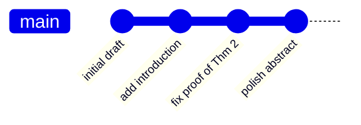
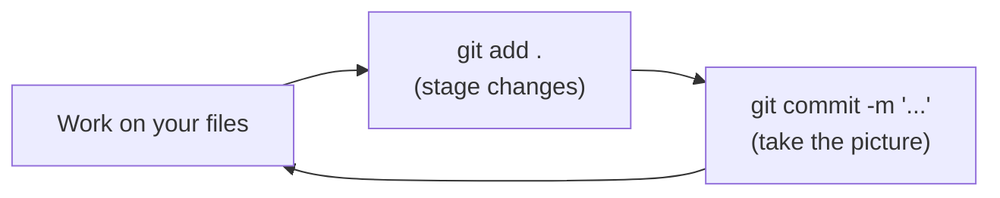
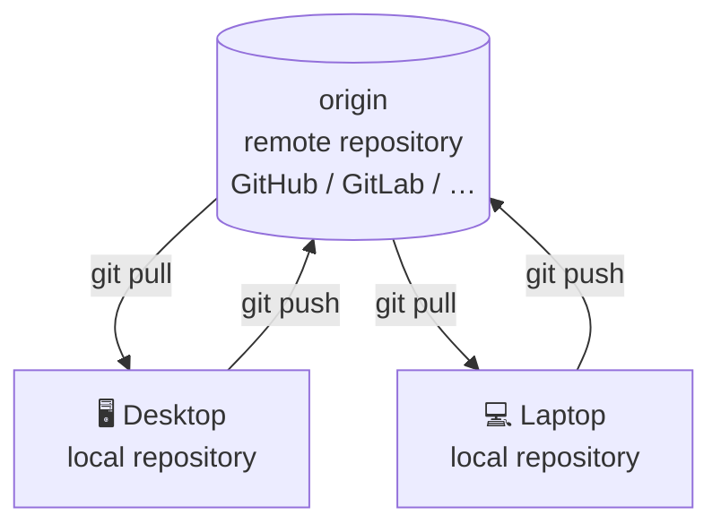
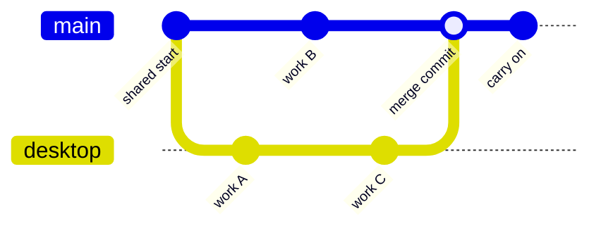
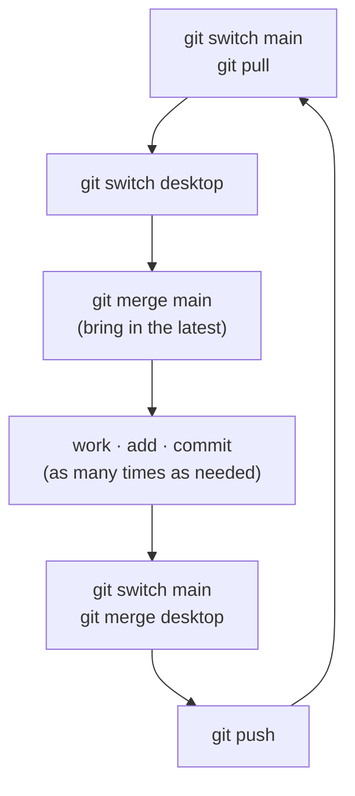
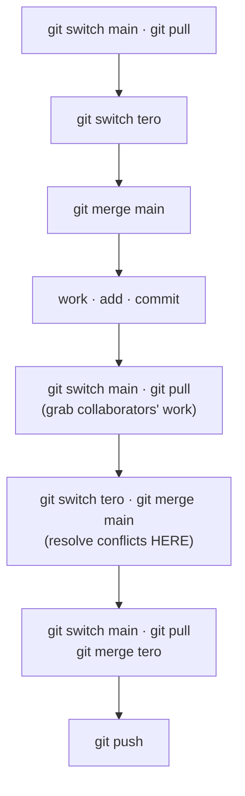
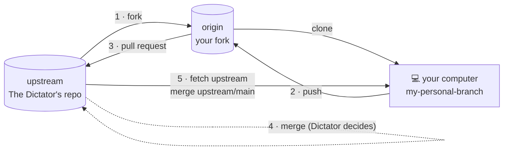

Si prefieres leer esta entrada en español, da clic [aquí](https://anteromontonio.github.io/blog/2026/git-para-matematicos).

### Motivation 

For the purpose of this blogpost I am going to assume that you, beloved reader, write papers collaboratively with other people. More precisely, I am going to assume that you do it using LaTeX. If you don't, you might still get something out of this blogpost, but it is mostly intended for people who somehow write documents using the following set up:
- You have a cloud service (e.g., Dropbox, Google Drive, OneDrive, iCloud) installed on your computer that you use to save, sync and share your files. For the purpose of this post, I am going to talk about the one that I personally use: FlyingCloud.[^1]
- You write your papers in LaTeX, and you have a folder in your cloud service that you share with your collaborators.
- You edit your files locally, using programs like Texmaker, TeXstudio, etc. If you use Overleaf, I still think that you should learn git and use overleaf as a remote, more on this [in the overleaf documentation](https://docs.overleaf.com/integrations-and-add-ons/git-integration-and-github-synchronization/git-integration).

If you fit the description above, most likely you have faced (at least) one of the following situations:
- You recognise the following names: `paper.tex`, `paper_1.tex`, `paper_1_afterRevisionsByTero.tex`, `paper_final.tex`, `paper_final_final.tex`, etc.
- You are constantly creating backups of your files just in case something goes wrong. 
- You are working on a file and your colleague is also working on the same file at the same time, resulting in a conflict that you have to solve manually. This happens a lot with FlyingCloud.
- One of your colleagues (or even yourself) accidentally deletes a file, and you have to recover it from the trash of your cloud service or pray to your favourite IT god that your cloud service has a backup of the file.
- You have been updating a file but your colleague does not see the changes because of a syncing issue with FlyingCloud.
- You are forced to set up a system to indicate that someone is working on the project and nobody else is allowed to edit (I've seen things as simple as sending an email, and things as convoluted as having a file that someone renames every time they are working on the project, e.g., `TeroIsWorking.txt`, which has to be renamed to `NobodyIsWorking.txt` when they are done, so that everyone has to check the file before starting to work on the project — and god forbid someone forgets one of the steps).

All of these are a consequence of essentially two problems: **multi-user synchronisation** and **version control**. Moreover, I would argue that both of them are really just **version control** problems. They create a lot of unnecessary friction and mental overload. These are not only technical problems but also social and psychological ones, and the academic world is already difficult enough to deal with without adding these extra problems. Fortunately, there is a solution to all of these problems, and that solution is called **git**.

[^1]: This is a hypothetical cloud service that I invented because this blogpost is not meant to be a rant against anyone in particular; all of them suffer from the problems discussed here.

### Preliminaries
**Disclaimers:**
1. This is not a tutorial for git. I am not going to explain how to use git in detail but rather walk you through the main concepts, trying to demystify it and remove as much noise as possible. The trade-off of this is that I might not be as precise as I could be, so, experienced git users, forgive me. If you want to go deeper into git, I have a section with further reading at the end of this post.
2. This blogpost is written using command line commands, but this is not necessary to use git. You can use different graphical environments to interact with git, and I will touch on them at the end. The important part of this post is that you focus on the ideas and concepts needed to navigate git, not on the specific commands.
3. I will assume that you have git installed. If you use Linux or macOS, you probably already have it; if you use Windows, you can install it from [here](https://git-scm.com/download/win). 

In short, git is a version control system created by Linus Torvalds (the guy who created Linux) in 2005. It is not the only version control system, but it is definitely the most popular, and it is almost a standard in the software development world. You don't need to be coding heavily or developing software to benefit from git: from git's perspective, writing papers in LaTeX is not so different from writing software in a very complicated programming language.

A natural question when I introduce git to people is: "why do I need git? I already have a cloud service that allows me to share files and have version history". If the problems described at the beginning of this blogpost are not enough reasons for you, let me give you an emotional one: just the same way your mom used that old camera to take pictures of you when you were a kid, and you keep those pictures as a memory of your childhood, git is a tool that allows you to keep a history of your projects. But it is much more, because (unlike your mom's camera) it also allows you to go back in time and change things in the past, giving you full control over your projects. 

I could give you several reasons why git is better than a cloud service, but I think that the best way to understand it is to see how it works in practice and let you discover them on your own. So, I will use a series of workflows to slowly introduce the basic concepts of git and how to use them. The workflows are ordered from the simplest to the more complex. I suggest you start using one where you feel comfortable (nothing wrong if it's the first one), you get familiar using git and slowly you add layers of complexity, either by following to the next one I propose or even better! by creating your own workflows that fit your specific needs and preferences. The important thing is that you start using git  as soon as possible.

### Workflow 1: the loner.
The setup is very basic: you have a personal computer where you keep your work and you do not collaborate with anyone. In this case, even a cloud service sounds like overkill (because you only use it to back up your files online). However, the setup is simple enough to start explaining git concepts. 

There are two relevant concepts for this set up: **repository** and **commit**. For most purposes a repository is just a synonym for project, but a better way of understanding it is to think of your project as a living entity that grows and changes, and the repository as the photo album that I was talking about before. Every once in a while you need to populate this album with pictures; these pictures are precisely the commits. To be slightly more precise, a commit is a snapshot that registers the state of your project at a particular moment in time. Git does not copy all the files, but rather it keeps track of the changes that you make to your files, and it allows you to go back in time and see how your project evolved.

Each commit has some metadata, like the date and who created it. Moreover, each commit has a message that you can write to describe the changes that you made in that commit. This is important because it allows you to remember what changes you made, and it is also useful when you want to go back in time and see the history of your project. Each commit also has a unique identifier, called a hash, which is a long string of characters, and a pointer to its parent commit (the previous picture in the album). This allows git to create a history of your project and to navigate through it.

Conceptually, the history of your project looks like a chain of pictures, each one pointing back to the one before it:



Now let's go to the practical things. Most likely your project lives in a folder on your computer. To enable git for this project, you need to initialise a repository in that folder. In the command line you do this by running the command

```bash
git init
```

This will create a hidden folder `.git` in your main folder with the set up for git. You do not need to worry about this folder; git will take care of its contents. Moreover, it is important that you **do not touch this folder yourself** (or via FlyingCloud), because you might mess up your repository.

Now, every time that you want to take a picture, you need to do two steps. For now, do not worry about what each of these steps does; just think of them as a single process that requires two commands.
1. Stage your changes. This tells git which files you want to include in the picture. You can do this by running the command
	```bash
	git add <list of files>
	```
	In practice, I usually want to include all the new files and all the modified files in the picture, so I just run
	```bash
	git add .
	```
2. Take the picture. This is the commit step, where you actually take the picture and save it in the album. You can do this by running the command
	```bash
	git commit -m "a message describing the changes"
	```
	The message is important because it allows you to remember what changes you made in that commit, and it is also useful when you want to go back in time and see the history of your project.

So the basic loop of working with git looks like this:



If I want to be completely honest, I actually have a single command predefined that does both steps at the same time. 

How often do you want to run these commands? As often as you want. I usually do it after each work session on the project, often one or two times a day. Keep in mind that if you don't do it, and you just shut down your computer, you have not lost any changes. If nothing goes wrong, your files are on your computer just as you left them. The only issue is that there is no picture in your album.

The workflow is very simple:
1. You work.
2. You use `git add <list of files>` to stage the changes you want to include in the commit.
3. You use `git commit -m "a message describing the changes"` to take the picture and save it in the album.

In most graphical interfaces for git, you will find a big button that says "commit", because commit is the most used action in git. You will also find a big button that says "*push*" or "*sync*", but we will talk about it later on.

### Workflow 2: the loner with two computers.
The hypothetical setup is the following: you have two computers, e.g., a desktop and a laptop, and you want to work on the same project from both of them. This is a very common situation for many people; in fact, this was the setup that I had when I first learned to use git in the last year of my PhD. For most people, the cloud service is the solution to this problem. You work a bit on your laptop, FlyingCloud syncs your files to the cloud, then you go to your desktop, and FlyingCloud syncs the files from the cloud to your desktop. However, as I mentioned before, this set up has many problems. Git provides a much better solution to this problem, and it is called **remote repositories**.

A remote repository is a copy of your album that lives somewhere else (often in the cloud). For each of your *local repositories* (the ones on your computers) you can have as many remote repositories as you want, but for the purpose of this workflow, we will assume that you have only one remote repository that lives in a git cloud service like [GitHub](https://github.com/), [GitLab](https://gitlab.com/), [Bitbucket](https://bitbucket.org/), etc. All of them work more or less the same: you create an account and then you create a new repository inside your account. I won't go into the details of how to do this, but it is usually very straightforward. Most likely your online repository will be empty and will have an associated url; for example, the one for this website is `https://github.com/anteromontonio/anteromontonio.github.io`.

The situation now looks like a hub with two computers around it: your two *local repositories* talk to each other only through the *remote repository* in the middle.



You work, say in your office (desktop), you do the two steps to take a picture (stage and commit), but now you want to upload this picture to the cloud so you can access it from your laptop later on. This action is called *push*, and it does exactly that: it pushes your local commits to the remote repository.

The first time you do it you need to tell git where your remote repository is. You do this by running the command
```bash
git remote add origin <url of your remote repository>
```
The word `origin` is just a name that you give to your remote repository; you can call it whatever you want, but `origin` is the standard name for the main remote repository. After this, you can push your commits to the remote repository by running the command
```bash
git push origin main
```
This tells git to push your commits to the remote repository called `origin` and to the branch called `main`. We will talk about branches later on, but for now, just assume that `main` is the default branch where you want to keep your commits. You can configure git to 'track' the remote repository so you don't have to specify `origin main` every time; you do this by running the command
```bash
git push -u origin main
```
After this, you can just run `git push` and git will know where to push your commits.

Now you move to your laptop and you want to get your project there. First, we need to bring the project to your laptop; this is called *cloning*, and it is the standard way you get repositories from the cloud to your computer. You do this by running the command
```bash
git clone <url of your remote repository>
```
This will create a new folder on your computer with the same name as your repository, and it will copy all the files from the remote repository to that folder. Keep in mind that cloning is actually copying a repository (it can be yours or someone else's). Now you can work, and when you are ready, you do `git add` and `git commit` as before, and to upload your changes to the cloud you do `git push` as before. Observe that if you clone a repository, it already knows where to push (the place where you cloned it from). If the repository is not yours, then GitHub (or the git cloud service of your choice) won't let you push, or will ask you for authentication.

When you go back to your office, you want to get the changes that you made on your laptop onto your desktop. This action is called *pull*, and it does exactly that: it pulls the commits from the remote repository to your local repository. You do this by running the command
```bash
git pull origin main
```
Most likely, git already knows where to pull from, so you can just run `git pull` and git will get the changes from the remote repository and merge them with your local repository.

Once you have a local repository on your laptop and a local repository on your desktop, both set up to track your remote repository (following the steps above), the workflow goes as follows:

1. You work on one of your computers (say the desktop), you do `git add` and `git commit` to take a picture of your project, and then you do `git push` to upload this picture to the cloud.
2. You move to your other computer (laptop) and you do `git pull` to get the changes that you made on your desktop. You work on your laptop, you do `git add` and `git commit` to take a picture of your project, and then you do `git push` to upload this picture to the cloud.
3. You move back to your desktop and you do `git pull` to get the changes that you made on your laptop. 

It is important to say that **you have to push and pull manually**. Unlike FlyingCloud, git does not automatically sync your files to the cloud; you have to do it manually by running the commands. This is actually a good thing because it gives you more control over your files and it prevents syncing issues. Moreover, it forces you to think about when you want to upload your changes to the cloud and when you want to get the changes from the cloud, which is important for collaboration (we will talk about this later on). It is also important to mention that git works offline. Unlike FlyingCloud, you can work completely offline and locally, you only need internet for a few seconds when you do push and pull. 

Needless to say, if you only work on a single device, you can easily adapt this workflow to get the online backup that FlyingCloud provides. You just manually push your commits to the remote once in a while (I do it after a day of work). This is a good point to mention that git and git remotes are great for backup but not really for everywhere-access synchronisation. I still have a FlyingCloud folder for projects where I put files that I want to have access to everywhere (my laptop and my phone) but I do not want to keep a history of, for example, PDFs or handwritten notes. Indeed, git is great for keeping the history of code files (like your `.tex` files), but not so much for keeping the history of binary files, that is, files that are generated from your code (like `.pdf`s). For LaTeX specifically, I suggest you use tools like [latexdiff](https://ctan.org/pkg/latexdiff), which allows you to compare two versions of a LaTeX file and see the differences between them. Latexdiff integrates wonderfully with git, and maybe another day I will show you how. 

### Workflow 3: the distracted loner
The setup is the same as before but closer to reality. Since git does not sync automatically, you might forget to push your changes to the cloud, and then you go to your other computer and you do not see the changes that you made. This is a very common situation, and even though it is a bit annoying (that's why you have to be disciplined and intentional when you use git), it also has its advantages. For example, it is almost impossible for you or your collaborators to delete a file by accident, since you would need to delete it *and* push that deletion; even when you pull afterwards, if the file was not deleted on the other computer, it will still be there.

If you are in the situation I described above (you forgot to push your changes and you don't see them on your other computer) I have bad news and good news for you. The bad news is that you have to go back to the computer where you made the changes and push them to the cloud. There is no simple way to get your files from the other computer if you do not intentionally transfer or push them into the remote. The good news is that you have not lost any work: your files are still on your computer just as you left them, and you can get them to the cloud whenever you want. But there is a natural problem in this situation: what if you want to work on a file that has unsynced changes on the other computer? The answer to this is **branches**, which is arguably git's most powerful feature. 

Git supports parallel timelines for your project. Coming back to the photo album analogy, it is as if the spacetime splits at a given point and sudently there are two different versions of you each of you with your own photo album. Each of this albums grow independently and in the future you can merge them together if you want. Branches is exactly the way git admins these different timelines.
I will try not to get too technical, but you can think of a branch as a coloured frame that you put around your pictures in the album, and that moves from one picture to another. By default, you have a branch called `main` (or `master` in older repositories), and all your commits are in that branch; that is, you have only one frame, and whenever you create a new commit, the frame moves to this new commit (usually from its parent). Now, if you want to work on a file that has unsynced changes on the other computer, you can create a new branch and work on that branch. This way, you can have two different versions of your project (one on the `main` branch and one on the new branch) and then merge them together when you want. You can create a new branch by running the command
```bash
git switch -c desktop
```
This will create a new branch called `desktop` and it will switch to that branch. Now you have a new coloured frame, `desktop`, and you can work on your files and create commits on that branch, moving the coloured frame each time (but the frame on `main` will stay on the same commit). I should mention that the **timelines exist regardless of the branches**, the branches are just the way git knows over which timeline keep building the project history. In mundane words: the timelines are all the pictures that at some point had the coloured frame on them, not the frames themselves. This is important because it is a common practice in git to create and delete branches. When you delete a branch you do not delete the history or the timeline, you just get rid of the (rather cheap) coloured frame.

Coming back at were we were, when you push your changes to the cloud, you need to specify the branch you want to push, for example
```bash
git push origin desktop
```
Now, when you are back on your laptop and you want to get the changes that you made on your desktop, you need to pull the branch that you created, for example
```bash
git pull origin desktop
```
This will get the changes from the `desktop` branch and merge them with your local repository. Now on your laptop you have two branches (`main` and `desktop`) and you can switch between them by running the command
```bash
git switch <name of the branch you want to switch to>
```
and when you do it, you get the version of the files that are on each of the respective branches (it works like magic!). Most likely you don't want to have two timelines for your project for a long period of time; when you are ready, you can **merge** the branches. Merging is the process of taking the changes from one branch and applying them to another branch. You can do this by running the command
```bash
git switch main   # so that we know we are sitting on main
git merge desktop # we merge the changes from desktop into main
```
This will take the changes from the `desktop` branch and apply them to the `main` branch.

Visually, creating a branch, working on it, and merging it back looks like this:



If the timelines are compatible, that is, if the changes that you made on the `desktop` branch do *not* contradict the changes that you made on the `main` branch, then git will merge them automatically and you will have a single timeline again (this is usually the case). However, if the changes that you made on the `desktop` branch *do* contradict the changes that you made on the `main` branch, then git will not be able to merge them automatically and it will ask you to solve the conflict manually. This is a bit more complicated but it is not that bad: you just need to open the files that have conflicts and look for the **conflict markers**. They look like this:
```
<<<<<<< HEAD # that is, your working place 
changes that you made in the main branch
======= # this is the separation between the two branches
changes that you made in the desktop branch
>>>>>>>
```
Now you need to decide which changes you want to keep. After you have solved the conflicts, you **need to stage the changes and commit them as usual**. This effectively creates a new commit on the `main` branch that has two parents: the last commit on the `main` branch and the last commit on the `desktop` branch. This is what is called a merge commit, and it is the point where the two branches merge together. After this, you can delete the `desktop` branch if you want, since all its changes are now on the `main` branch. You can do this by running the command
```bash
git branch -d desktop
```
Deleting a branch does not delete files; you just get rid of the coloured frame. 

I know that you must have a headache at this point, so I will clean up what I just explained above with a simple workflow that is actually the one that I use in most of my projects and that often avoids conflicts. The workflow is the following:

1. You will have three branches: `desktop`, `laptop` and `main`. 
2. You will never work while on `main`, but this will be the most up-to-date branch, so the first thing that you do before starting to work is `git switch main` (to make sure you are on `main`) and then `git pull` to get the most recent changes. 
3. You will work on `desktop` (or `laptop`) depending on where you are, so now you need to move to this branch: `git switch desktop`. 
4. Now you bring in the most recent changes from `main`: `git merge main` (this is important because it will prevent conflicts later on).
5. You work, stage changes and commit, as many times as necessary. 
6. When you are done, you switch back to `main` and you merge the working session on `desktop`: `git switch main` and then `git merge desktop`.
7. You push the changes to the cloud: `git push`.
8. When you are back on your laptop you repeat the same steps but using the branch `laptop`.

Here is the same disciplined loop as a diagram (shown for `desktop`; the laptop side is identical with `laptop` in place of `desktop`):



Notice that the branch `desktop` never makes it to the laptop computer and vice versa; this is by design and it is very useful to avoid conflicts, but it is not strictly necessary. You can have a single branch for both computers (that is what I usually have, and this branch is often called `dev-tero`) and you just merge it into `main` when you are done. Of course, you need to become disciplined when doing this.

### Workflow 4: the collaborator
In the previous workflow, it is almost irrelevant that the person working on the laptop and the person working on the desktop are the same. The only relevant point is that this makes sure that the `main` branch is not updated by the person in front of the laptop while you are working on the desktop. This workflow can be easily modified to collaborate with other people, as long as you all agree that the `main` branch is the most up-to-date branch and that you will never work while on `main`. The workflow is the following:

1. Each collaborator will have their own personal branch, e.g., `tero`, `alice`, `bob`, etc., and these usually won't make it to the remote (although they could).
2. Before starting to work, each collaborator will switch to `main` and pull the most recent changes: `git switch main` and then `git pull`.
3. Each collaborator will switch to their personal branch: `git switch tero` (or `git switch alice`, or `git switch bob`).
4. Each collaborator will merge the most recent changes from `main`: `git merge main`.
5. Each collaborator will work, add and commit, as many times as necessary.
6. When a collaborator is done, they will switch back to `main` and **pull again** to get the most recent changes that other collaborators might have pushed while they were working: `git switch main` and then `git pull`.
7. Now they switch back to their personal branch and merge the changes from `main`: `git switch tero` and then `git merge main`. If conflicts arise, they should be resolved on the personal branch, leaving `main` clean.
8. Once conflicts are resolved (if any), the collaborator switches back to `main`, pulls again to make sure they have the most recent changes, and then merges their personal branch into `main`: `git switch main`, `git pull` and then `git merge tero`. This process should be mostly conflict-free because `tero` and a (potentially) slightly old version of `main` already agree, so git will know how to handle the merge.
9. Finally, the collaborator pushes the changes to the cloud: `git push`.

The key idea is that all the risky merging happens on your *personal* branch, so `main` stays clean and every collaborator pulls before they push:



How your collaborators get access to the remote depends on the git cloud service that you are using, and often **it is not enough just to share the link with them**. The [instructions for GitHub](https://docs.github.com/en/repositories/managing-your-repositorys-settings-and-features/repository-access-and-collaboration/inviting-collaborators-to-a-personal-repository) are fairly straightforward, but they require that your collaborators have a GitHub account. If you are a collaborator of mine, I hope this blogpost motivates you to create a GitHub account and learn how to use git; otherwise, I hope you can use this blogpost to motivate your collaborators.

### Workflow 5: the dictator
This workflow is a bit more complicated, but it is very useful when you have a lot of collaborators, and to be honest, this is the standard way in which gigantic projects (think of the Linux kernel developers) collaborate. The idea is conceptually not very complicated, and I will include it just for completeness.

There is a central repository, maintained and owned by *The Dictator* and often hosted on a git cloud service. Let's say that you want to collaborate on this project; you do it following the steps below:
1. You **fork** the repository. This means you create a copy of this repository that is now your own; you can modify it, break it and do whatever you want with it, and it will not affect the original repository. The first step to build this website was to fork the [al-folio multi-language repository](https://github.com/george-gca/multi-language-al-folio). 
2. You work on this repository — from home, from your laptop, however you want — but keeping a personal branch (different from `main`) as your most up-to-date branch. This means you will have a branch, say `my-personal-branch`, that will play the role of `main` in the previous workflows (and you can have several other branches if you want).
3. When you have produced changes that you want The Dictator to see and potentially include in the main project, you [create a pull request](https://docs.github.com/en/pull-requests/collaborating-with-pull-requests/proposing-changes-to-your-work-with-pull-requests/creating-a-pull-request). That is, you inform The Dictator that you forked their repository, that you have worked on it, and that you want them to pull the changes that you made in your forked repository. 
4. Since git keeps track of changes, The Dictator will be able to track the changes that you made and decide if and how to incorporate them into the main repository. If The Dictator decides to incorporate your changes, they will merge your pull request and the changes that you made in your forked repository will be merged into the main repository. If The Dictator decides not to incorporate your changes, they will just close the pull request and nothing will happen.
5. If you were successful, you can now update your forked copy (in case you want to continue working on this repository) by doing the following:
	1. Add their remote as a remote to your local copy:
		```bash
		git remote add upstream https://github.com/ORIGINAL_OWNER/REPO.git
		```
	2. **Fetch** the changes from their repository, that is, bring the changes to your computer:
		```bash
		git fetch upstream
		```
	3. Merge the changes from their repository into your local repository:
		```bash
		git switch main
		git merge upstream/main
		```
	4. Push the changes to your forked repository:
		```bash
		git push origin main
		```

The whole fork-and-pull-request cycle looks like this:



### Concluding remarks and further reading
I really hope that this blogpost turns git into something less scary than it seems. Believe me, if you already write papers or documents in LaTeX, you are doing something much more difficult than using git. Please, do not expect to learn how to use git in a day; it is a complex tool and it takes time to get used to it, but I promise you that it is worth it. I suggest that you go over the workflows, pick one that satisfies your needs, and stick to it until it becomes automatic. You can later move on to a more complex one. 

If you want to dig deeper into how to use git, I suggest the following:

- [Git Will Finally Make Sense After This](https://www.youtube.com/watch?v=Ala6PHlYjmw) – A YouTube video that explains git in a very beginner-friendly way; you can see the influence of its approach in this blogpost.
- [Git for mathematicians](https://g4m.code4math.org/g4m.html) – A book by [Steven Clontz](https://clontz.org/) that explains git for mathematicians. It is very well written, and it is a great resource to learn git in depth. It is also free online.
- The Software Carpentry notes on git, which are available in [English](https://swcarpentry.github.io/git-novice) and in [Spanish](https://swcarpentry.github.io/git-novice-es/) (and maybe in other languages, I am not sure). They are intended to be for completely beginners and available completely free online.
