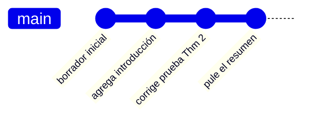
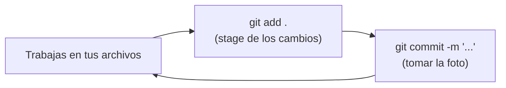
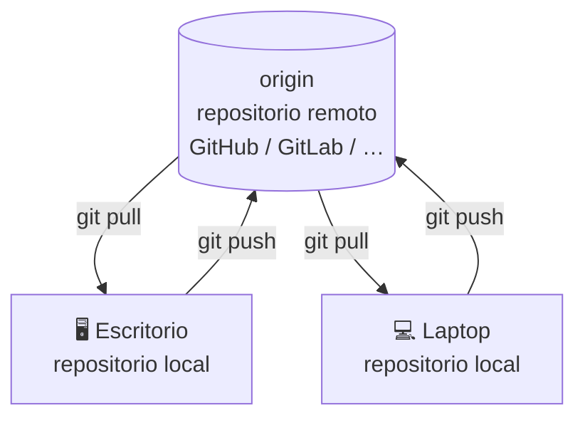
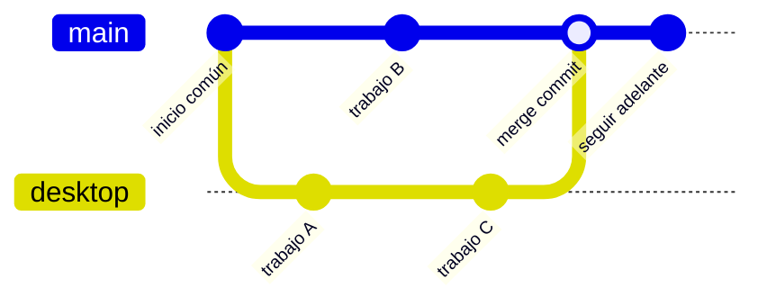
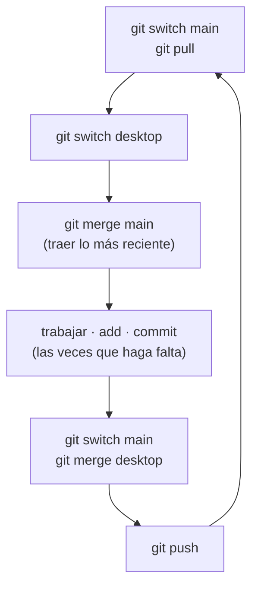
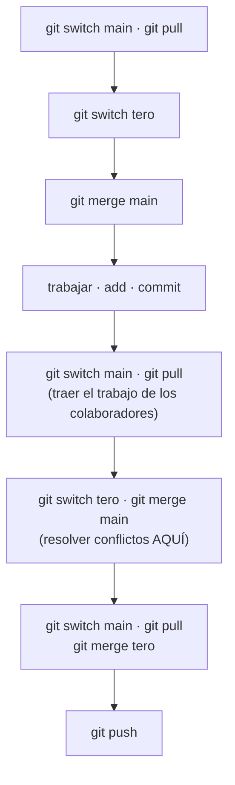
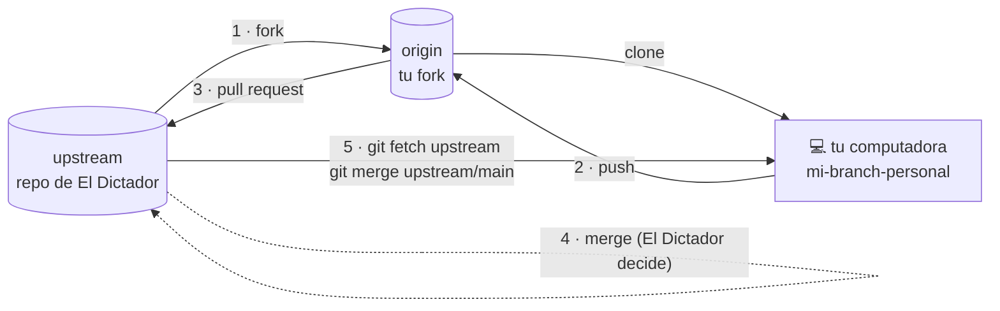

You can read the English version of this post [here](https://anteromontonio.github.io/blog/2026/git-for-mathematicians).

### Motivación 

Para esta entrada voy a suponer que tú, querido lector, escribes artículos en colaboración con otras personas. Más concretamente, voy a suponer que lo haces en LaTeX. Si no es tu caso, quizá todavía le saques algo de provecho, pero la entrada está pensada sobre todo para quienes escriben documentos con la siguiente configuración:
- Tienes un servicio en la nube (Dropbox, Google Drive, OneDrive, iCloud) instalado en tu computadora, y lo usas para guardar, sincronizar y compartir tus archivos. Para esta entrada voy a hablar del que yo uso: FlyingCloud.[^1]
- Escribes tus artículos en LaTeX y tienes una carpeta en la nube que compartes con tus colaboradores.
- Editas tus archivos localmente, con programas como Texmaker, TeXstudio, etc. Si usas Overleaf, de todas maneras creo que deberías aprender a usar git y usar Overleaf como remoto; puedes ver como en la [documentación de Overleaf](https://docs.overleaf.com/integrations-and-add-ons/git-integration-and-github-synchronization/git-integration).

Si encajas en esa descripción, lo más probable es que te hayas topado con (al menos) una de estas situaciones:
- Te suenan los siguientes nombres: `paper.tex`, `paper_1.tex`, `paper_1_afterRevisionsByTero.tex`, `paper_final.tex`, `paper_final_final.tex`, etc.
- Vives haciendo copias de respaldo de tus archivos por si algo sale mal. 
- Estás trabajando en un archivo y tu colega está trabajando en el mismo archivo al mismo tiempo, y eso provoca un conflicto que tienes que resolver a mano. Con FlyingCloud esto pasa muchísimo.
- Alguno de tus colegas (o tú mismo) borra un archivo sin querer, y te toca recuperarlo de la papelera del servicio en la nube o rezarle a tu dios informático favorito para que haya un respaldo.
- Llevas rato actualizando un archivo, pero tu colega no ve los cambios por algún problema de sincronización de FlyingCloud.
- Te ves obligado a inventar un sistema para avisar que alguien está trabajando en el proyecto y que nadie más puede editar. (He visto desde cosas tan simples como mandar un correo hasta cosas tan enredadas como tener un archivo que alguien renombra cada vez que se pone a trabajar, por ejemplo `TeroEstaTrabajando.txt`, y que hay que volver a renombrar a `NadieEstaTrabajando.txt` al terminar, de modo que todos tienen que revisarlo antes de empezar… y dios no quiera que a alguien se le pase uno de los pasos.)

Todo esto sale, en el fondo, de dos problemas: la **sincronización entre varias personas** y el **control de versiones**. Es más, yo diría que ambos son en realidad un mismo problema de **control de versiones**. Y generan un montón de fricción innecesaria y de carga mental. No son solo problemas técnicos: también son sociales y psicológicos, y el mundo académico ya es bastante complicado de por sí como para encima cargar con ellos. Por suerte, hay una solución a todos estos problemas, y se llama **git**.

[^1]: Es un servicio en la nube hipotético que me inventé, porque esta entrada no es un reclamo contra nadie en particular; todos sufren de los problemas que comento aquí.

### Preliminares
**Aclaraciones:**
1. Esto no es un tutorial de git. No voy a explicar a fondo cómo se usa, sino más bien pasearte por las ideas principales para desmitificarlo y quitarle el mayor ruido posible. El costo de esto es que quizá no sea tan preciso como podría; así que, usuarios experimentados de git, perdónenme. Si quieres profundizar, al final dejo una sección de lecturas recomendadas.
2. La entrada está escrita usando la línea de comandos, pero eso no es indispensable para usar git: hay varios entornos gráficos para trabajar con él, y los menciono al final. Lo importante es que te quedes con las ideas y los conceptos para moverte en git, no con los comandos concretos.
3. Voy a dar por hecho que tienes git instalado. Si usas Linux o macOS, lo más seguro es que ya venga; si usas Windows, lo puedes instalar desde [aquí](https://git-scm.com/download/win). 

En pocas palabras, git es un sistema de control de versiones que creó Linus Torvalds (el tipo que creó Linux) en 2005. No es el único, pero sí es por mucho el más popular y prácticamente un estándar en el mundo del desarrollo de software. No hace falta que programes a destajo ni que desarrolles software para sacarle provecho: desde el punto de vista de git, escribir artículos en LaTeX no es tan distinto de escribir software en un lenguaje de programación muy complicado.

Una pregunta natural cuando le presento git a alguien es: "¿y para qué quiero git? Si ya tengo un servicio en la nube que me deja compartir archivos y tener historial de versiones". Si los problemas del inicio no te convencen, déjame darte una razón sentimental: así como tu mamá usaba esa cámara vieja para tomarte fotos de niño, y tú guardas esas fotos como recuerdo de tu infancia, git es una herramienta que te deja guardar la historia de tus proyectos. Pero es mucho más, porque (a diferencia de la cámara de tu mamá) también te deja regresar en el tiempo y cambiar cosas del pasado, dándote control total sobre tus proyectos. 

Te podría dar una lista de razones más concretas, pero creo que lo mejor es mostrarte cómo funciona git en la práctica, y que tú mismo veas por qué es tan útil. Voy a usar una serie de workflows para ir presentando, poco a poco, los conceptos básicos de git y cómo usarlos. Los workflows están ordenados del más simple al más complejo y sugiero que adoptes uno (todo bien si es el primero), te vuelvas familiar con git y poco a poco vayas añadiendo capas de complejidad a tu workflow (siguiendo alguno de los que yo describo o mejor! adaptando a tus necesidades). Lo importante es que empieces a usar git a las de ya!

### Workflow 1: el solitario.
La situación es de lo más básica: tienes una computadora personal donde guardas tu trabajo y no colaboras con nadie. Aquí hasta un servicio en la nube suena excesivo (solo lo usarías para respaldar tus archivos en línea), pero es un escenario bastante simple para empezar a explicar los conceptos de git. 

Hay dos conceptos relevantes para esta situación: el **repositorio** y el **commit**. Para casi todo, un repositorio no es más que un sinónimo de proyecto, pero una mejor forma de entenderlo es pensar en tu proyecto como un ser vivo que crece y cambia, y en el repositorio como el álbum de fotos del que hablaba antes. Cada cierto tiempo necesitas ponerle fotos a ese álbum, y esas fotos son justamente los commits. Para ser un poco más precisos, un commit es una instantánea que registra el estado de tu proyecto en un momento dado. Git no copia todos los archivos: lo que hace es llevar la cuenta de los cambios que les vas haciendo, y eso te permite regresar en el tiempo y ver cómo fue evolucionando tu proyecto.

Cada commit trae algo de metadatos, como la fecha y quién lo creó. Además, cada commit lleva un mensaje que escribes para describir los cambios que metiste. Esto importa porque te deja recordar qué cambiaste, y también es útil cuando quieres regresar en el tiempo y revisar la historia del proyecto. Cada commit tiene además un identificador único, llamado hash, que es una cadena larga de caracteres, y un apuntador a su commit padre (la foto anterior del álbum). Así es como git arma la historia de tu proyecto y te deja navegar por ella.

A grandes rasgos, la historia de tu proyecto se ve como una cadena de fotos, cada una apuntando a la anterior:



Ahora sí, vamos a lo práctico. Lo más seguro es que tu proyecto viva en una carpeta de tu computadora. Para activar git en ese proyecto, hay que inicializar un repositorio en esa carpeta. En la línea de comandos esto se hace con

```bash
git init
```

Esto crea una carpeta oculta `.git` dentro de tu carpeta principal, con toda la configuración de git. No tienes que preocuparte por ella; git se encarga de su contenido. Eso sí, es importante que **no la toques tú mismo** (ni a través de FlyingCloud), porque podrías arruinar tu repositorio.

Cada vez que quieras tomar una foto, tienes que dar dos pasos. Por ahora no te preocupes por lo que hace cada uno; piénsalos como un solo proceso que necesita dos comandos.
1. Hacer **stage** de tus cambios. Esto le dice a git qué archivos quieres incluir en la foto. Se hace con
	```bash
	git add <lista de archivos>
	```
	En la práctica casi siempre quiero incluir todos los archivos nuevos y todos los modificados, así que simplemente corro
	```bash
	git add .
	```
2. Tomar la foto. Este es el paso del commit, donde de verdad tomas la foto y la guardas en el álbum. Se hace con
	```bash
	git commit -m "un mensaje describiendo los cambios"
	```
	El mensaje importa porque te deja recordar qué cambiaste en ese commit, y es útil cuando quieres regresar en el tiempo y revisar la historia del proyecto.

Así que el ciclo básico de trabajo con git se ve así:



Si soy completamente honesto, en realidad tengo un solo comando predefinido que hace los dos pasos de un jalón. 

¿Cada cuánto conviene correr estos comandos? Cada que quieras. Yo suelo hacerlo al terminar cada sesión de trabajo, muchas veces una o dos al día. Ten en cuenta que si no lo haces y simplemente apagas la computadora, no pierdes ningún cambio: si nada sale mal, tus archivos siguen ahí tal como los dejaste. Lo único que pasa es que no queda esa foto en el álbum.

El workflow es muy simple:
1. Trabajas.
2. Haces `git add <lista de archivos>` para hacer stage de los cambios que quieres incluir en el commit.
3. Haces `git commit -m "un mensaje describiendo los cambios"` para tomar la foto y guardarla en el álbum.

En casi cualquier interfaz gráfica de git vas a encontrar un botón grandote que dice "commit", porque commit es la acción que más se usa. También vas a ver un botón grande de "*push*" o "*sync*", pero de eso hablamos más adelante.

### Workflow 2: el solitario con dos computadoras.
La situación hipotética es esta: tienes dos computadoras, por ejemplo una de escritorio y una laptop, y quieres trabajar en el mismo proyecto desde las dos. Es algo muy común; de hecho, así era como yo trabajaba cuando aprendí a usar git, en el último año del doctorado. Para la mayoría, el servicio en la nube es la solución: trabajas un rato en la laptop, FlyingCloud sube los archivos a la nube, luego te pasas al escritorio y FlyingCloud baja los archivos de la nube al escritorio. Pero, como ya dije, esta configuración tiene muchos problemas. Git ofrece una solución mucho mejor, y se llama **repositorios remotos**.

Un repositorio remoto es una copia de tu álbum que vive en otro lado (muchas veces en la nube). Por cada uno de tus *repositorios locales* (los que están en tus computadoras) puedes tener todos los repositorios remotos que quieras, pero para este workflow vamos a suponer que tienes uno solo, alojado en un servicio en la nube de git como [GitHub](https://github.com/), [GitLab](https://gitlab.com/), [Bitbucket](https://bitbucket.org/), etc. Todos funcionan más o menos igual: creas una cuenta y dentro de ella creas un repositorio nuevo. No voy a entrar en el detalle de cómo hacerlo, pero suele ser muy directo. Lo más probable es que tu repositorio en línea quede vacío y con una url asociada; por ejemplo, la de este sitio es `https://github.com/anteromontonio/anteromontonio.github.io`.

La cosa queda como un centro con dos computadoras alrededor: tus dos *repositorios locales* se comunican entre sí únicamente a través del *repositorio remoto* que está en medio.



Trabajas, digamos en la oficina (escritorio), das los dos pasos para tomar la foto (stage y commit), pero ahora quieres subir esa foto a la nube para poder verla luego desde la laptop. Esa acción se llama hacer un **push**, y hace justo eso: sube tus commits locales al repositorio remoto.

La primera vez tienes que decirle a git dónde está tu repositorio remoto. Eso se hace con
```bash
git remote add origin <url de tu repositorio remoto>
```
La palabra `origin` es solo el nombre que le das a tu repositorio remoto; puedes ponerle el que quieras, pero `origin` es el nombre estándar para el remoto principal. Después de esto, ya puedes hacer push de tus commits al remoto con
```bash
git push origin main
```
Esto le dice a git que suba tus commits al remoto `origin` y al branch llamado `main`. De las branches hablamos más adelante; por ahora basta con suponer que `main` es la branch por defecto donde quieres guardar tus commits. Puedes configurar git para que 'rastree' el remoto y no tener que escribir `origin main` cada vez, con
```bash
git push -u origin main
```
Después de esto te basta con correr `git push` y git ya sabrá a dónde subir tus commits.

Ahora te pasas a la laptop y quieres tener ahí tu proyecto. Primero hay que traerlo a la laptop; esto se llama hacer un **clone**, y es la forma estándar de bajarte repositorios de la nube a tu computadora. Se hace con
```bash
git clone <url de tu repositorio remoto>
```
Esto crea una carpeta nueva en tu computadora, con el mismo nombre que el repositorio, y copia ahí todos los archivos del remoto. Ten en cuenta que un clone es, literalmente, copiar un repositorio (tuyo o de alguien más). A partir de ahí trabajas y, cuando estés listo, haces `git add` y `git commit` como antes, y para subir tus cambios a la nube haces `git push` como antes. Fíjate que, si clonaste un repositorio, este ya sabe a dónde hacer push (al lugar de donde lo clonaste). Si el repositorio no es tuyo, entonces GitHub (o el servicio que uses) no te dejará hacer push, o te pedirá autenticarte.

Cuando regresas a la oficina, quieres traer al escritorio los cambios que hiciste en la laptop. Esa acción se llama hacer un **pull**, y hace justo eso: baja los commits del remoto a tu repositorio local. Se hace con
```bash
git pull origin main
```
Lo más probable es que git ya sepa de dónde hacer pull, así que te basta con `git pull` y git traerá los cambios del remoto y los integrará con tu repositorio local.

Una vez que tienes un repositorio local en la laptop y otro en el escritorio, ambos configurados para rastrear el remoto (siguiendo los pasos de arriba), el workflow queda así:

1. Trabajas en una de tus computadoras (digamos el escritorio), haces `git add` y `git commit` para tomar la foto del proyecto, y luego `git push` para subirla a la nube.
2. Te pasas a la otra computadora (laptop) y haces `git pull` para traer los cambios que hiciste en el escritorio. Trabajas en la laptop, haces `git add` y `git commit` para tomar la foto, y luego `git push` para subirla a la nube.
3. Regresas al escritorio y haces `git pull` para traer los cambios que hiciste en la laptop. 

Algo importante: **el push y el pull los tienes que hacer a mano**. A diferencia de FlyingCloud, git no sube tus archivos a la nube solo; lo tienes que hacer tú corriendo los comandos. Y eso en realidad es bueno, porque te da más control sobre tus archivos y evita líos de sincronización. Además te obliga a pensar en qué momento quieres subir tus cambios y en qué momento quieres bajar los de la nube, algo que importa mucho a la hora de colaborar (ya llegaremos a eso). También es importante mencionar que git funciona sin conexión. A diferencia de FlyingCloud, puedes trabajar completamente sin internet y de forma local; solo necesitas unos segundos de conexión cuando haces push o pull.

Ni falta decir que, si solo trabajas en un único dispositivo, puedes adaptar fácilmente este workflow para tener el respaldo en línea que da FlyingCloud: simplemente haces push de tus commits al remoto de vez en cuando (yo lo hago al cerrar el día). Aquí vale la pena aclarar que git y los remotos son geniales para respaldar, pero no tanto para tener acceso sincronizado desde todos lados. Yo todavía conservo una carpeta de FlyingCloud para los proyectos, donde pongo archivos a los que quiero llegar desde donde sea (laptop y celular) pero de los que no me interesa llevar historia, por ejemplo PDFs o notas a mano. En efecto, git es buenísimo para llevar la historia de archivos de código (como tus `.tex`), pero no tanto para archivos binarios, es decir, los que se generan a partir de tu código (como los `.pdf`). Para LaTeX en concreto, te recomiendo herramientas como [latexdiff](https://ctan.org/pkg/latexdiff), que te deja comparar dos versiones de un archivo de LaTeX y ver las diferencias. latexdiff se lleva de maravilla con git, y quizá otro día te muestre cómo. 

### Workflow 3: el solitario distraído
La situación es la misma que antes, pero más apegada a la realidad. Como git no sincroniza solo, se te puede pasar hacer push de tus cambios, y entonces llegas a la otra computadora y no ves lo que hiciste. Es algo muy común y, aunque es un poco molesto (por eso hay que ser disciplinado e intencional al usar git), también tiene su lado bueno. Por ejemplo, es casi imposible que tú o tus colaboradores borren un archivo por accidente, porque tendrías que borrarlo *y además* hacer push de ese borrado; y aun cuando hagas pull después, si el archivo no se borró en la otra computadora, ahí va a seguir.

Si te encuentras en la situación de arriba (se te olvidó hacer push y no ves tus cambios en la otra computadora) tengo malas y buenas noticias. La mala es que vas a tener que volver a la computadora donde hiciste los cambios y subirlos a la nube. No hay forma sencilla de traer esos archivos desde la otra máquina si no los transfieres o les haces push al remoto a propósito. La buena es que no perdiste nada de trabajo: tus archivos siguen en tu computadora tal como los dejaste, y los puedes subir a la nube cuando quieras. Pero aquí surge un problema natural: ¿qué pasa si quieres trabajar en un archivo que tiene cambios sin sincronizar en la otra computadora? La respuesta son las **branches**, que es quizá la característica más poderosa de git. 

Git admite líneas de tiempo paralelas para tu proyecto. Volviendo a la analogía del álbum de fotos, es como si el espacio-tiempo se dividiera en un punto y de repente hubiera dos versiones distintas de ti, cada una con su propio álbum. Cada álbum crece de forma independiente y en el futuro puedes unirlos si quieres. Las branches son exactamente la forma en que git gestiona esas distintas líneas de tiempo. Voy a tratar de no ponerme demasiado técnico, pero puedes pensar en una branch como un marco de color que le pones a tus fotos del álbum y que se va moviendo de una foto a otra. Por defecto tienes una branch llamada `main` (o `master` en repositorios más viejos), y todos tus commits caen ahí; es decir, tienes un solo marco, y cada vez que haces un commit nuevo el marco se mueve a ese commit nuevo (normalmente desde su padre). Ahora bien, si quieres trabajar en un archivo que tiene cambios sin sincronizar en la otra computadora, puedes crear una branch nueva y trabajar en ella. Así tienes dos versiones distintas del proyecto (una en `main` y otra en la branch nueva) que luego unes cuando quieras. Una branch nueva se crea con
```bash
git switch -c desktop
```
Esto crea una branch nueva llamada `desktop` y se cambia a ella. Ahora tienes un marco de color nuevo, `desktop`, y puedes trabajar en tus archivos y hacer commits en esa branch, moviendo el marco cada vez (mientras que el marco de `main` se queda en el mismo commit). Debo mencionar que **las líneas de tiempo existen independientemente de las branches**; las branches son solo la forma en que git sabe sobre qué línea de tiempo seguir construyendo la historia del proyecto. En palabras más sencillas: las líneas de tiempo son todas las fotos que en algún momento tuvieron el marco de color, no los marcos en sí. Esto importa porque en git es práctica común crear y borrar branches. Cuando borras una branch no borras la historia ni la línea de tiempo; solo te deshaces del (bastante barato) marco de color.
Volviendo a donde estábamos, cuando hagas push de tus cambios a la nube tienes que indicar la branch, por ejemplo
```bash
git push origin desktop
```
Luego, cuando vuelvas a la laptop y quieras traer los cambios que hiciste en el escritorio, tienes que hacer pull de esa branch, por ejemplo
```bash
git pull origin desktop
```
Esto trae los cambios de la branch `desktop` y los integra a tu repositorio local. Ahora en la laptop tienes dos branches (`main` y `desktop`) y te puedes mover entre ellas con
```bash
git switch <nombre de la branch a la que te quieres cambiar>
```
y al hacerlo obtienes la versión de los archivos que está en cada branch (¡funciona como magia!). Lo más seguro es que no quieras tener dos líneas de tiempo de tu proyecto por mucho tiempo; cuando estés listo, puedes hacer un **merge** de las branches. Hacer merge es tomar los cambios de una branch y aplicarlos a otra. Se hace con
```bash
git switch main   # para asegurarnos de que estamos parados en main
git merge desktop # integramos los cambios de desktop a main
```
Esto toma los cambios de la branch `desktop` y los aplica a la branch `main`.

Visualmente, crear una branch, trabajar en ella y hacerle merge de regreso se ve así:



Si las líneas de tiempo son compatibles, es decir, si los cambios que hiciste en `desktop` *no* contradicen los que hiciste en `main`, git hará el merge automáticamente y volverás a tener una sola línea de tiempo (esto es lo más común). Pero si los cambios de `desktop` *sí* contradicen los de `main`, git no podrá hacer el merge solo y te pedirá resolver el conflicto a mano. Es un poco más latoso, pero nada del otro mundo: solo tienes que abrir los archivos en conflicto y buscar los **marcadores de conflicto**. Se ven así:
```
<<<<<<< HEAD # esto es, donde estás trabajando 
cambios que hiciste en la branch main
======= # esta es la separación entre las dos branches
cambios que hiciste en la branch desktop
>>>>>>>
```
Ahí decides con qué cambios te quedas. Una vez resueltos los conflictos, haces stage de los cambios y commit como siempre. Esto crea un commit nuevo en `main` con dos padres: el último commit de `main` y el último de `desktop`. A eso se le llama un merge commit, y es el punto donde se juntan los dos branches. Después de esto puedes borrar la branch `desktop` si quieres, ya que todos sus cambios están ahora en `main`. Se hace con
```bash
git branch -d desktop
```
Borrar una branch no borra archivos; solo te deshaces del marco de color. 

Sé que a estas alturas debes traer dolor de cabeza, así que voy a ordenar todo lo de arriba con un workflow simple, que de hecho es el que uso en casi todos mis proyectos y que suele evitar conflictos. Va así:

1. Vas a tener tres branches: `desktop`, `laptop` y `main`. 
2. Nunca vas a trabajar estando en `main`, pero esa va a ser la branch más al día; así que lo primero antes de empezar es `git switch main` (para asegurarte de estar en `main`) y luego `git pull` para traer lo más reciente. 
3. Vas a trabajar en `desktop` (o `laptop`) según dónde estés, así que primero te mueves a esa branch: `git switch desktop`. 
4. Ahora traes lo más reciente de `main`: `git merge main` (esto importa, porque te evita conflictos más adelante).
5. Trabajas, haces add y commit, las veces que haga falta. 
6. Al terminar, regresas a `main` y le haces merge a la sesión de trabajo de `desktop`: `git switch main` y luego `git merge desktop`.
7. Haces push de los cambios a la nube: `git push`.
8. Cuando vuelvas a la laptop, repites los mismos pasos pero con la branch `laptop`.

Aquí está ese mismo ciclo disciplinado en forma de diagrama (lo muestro para `desktop`; del lado de la laptop es idéntico, con `laptop` en lugar de `desktop`):



Fíjate que la branch `desktop` nunca llega a la laptop, ni viceversa; esto es a propósito y ayuda mucho a evitar conflictos, aunque no es estrictamente necesario. Puedes tener una sola branch para ambas computadoras (que es lo que yo suelo hacer, y a esa branch la llamo `dev-tero`) y le haces merge a `main` al terminar. Claro que para esto hay que volverse disciplinado.

### Workflow 4: el colaborador
En el workflow anterior es casi irrelevante que quien trabaja en la laptop y quien trabaja en el escritorio sean la misma persona. Lo único que importa es asegurarse de que la branch `main` no la actualice quien está frente a la laptop mientras tú trabajas en el escritorio. Este workflow se adapta fácilmente para colaborar con otras personas, siempre que todos acuerden que `main` es la branch más al día y que nunca van a trabajar estando en `main`. Va así:

1. Cada colaborador tendrá su propia branch personal, por ejemplo `tero`, `alice`, `bob`, etc., y normalmente no llegarán al remoto (aunque podrían).
2. Antes de empezar, cada colaborador se cambia a `main` y hace pull de lo más reciente: `git switch main` y luego `git pull`.
3. Cada colaborador se cambia a su branch personal: `git switch tero` (o `git switch alice`, o `git switch bob`).
4. Cada colaborador le hace merge a lo más reciente de `main`: `git merge main`.
5. Cada colaborador trabaja, hace add y commit las veces que haga falta.
6. Al terminar, el colaborador regresa a `main` y **vuelve a hacer pull** para traer los cambios más recientes que otros colaboradores hayan subido mientras él trabajaba: `git switch main` y luego `git pull`.
7. Ahora vuelve a su branch personal y le hace merge a los cambios de `main`: `git switch tero` y luego `git merge main`. Si salen conflictos, se resuelven en la branch personal, dejando `main` limpio.
8. Una vez resueltos los conflictos (si los hubo), el colaborador regresa a `main`, hace pull de nuevo para asegurarse de tener lo más reciente, y luego le hace merge a su branch personal: `git switch main`, `git pull` y luego `git merge tero`. Este paso debería salir casi sin conflictos, porque `tero` y una versión (quizá un poco vieja) de `main` ya están de acuerdo, así que git sabrá cómo resolver el merge.
9. Por último, el colaborador hace push de los cambios a la nube: `git push`.

La idea clave es que todo el merge riesgoso pasa en tu branch *personal*, de modo que `main` se mantiene limpio y cada colaborador hace pull antes de hacer push:



Cómo le das acceso al remoto a tus colaboradores depende del servicio en la nube de git que uses, y muchas veces **no basta con pasarles el enlace**. Las [instrucciones de GitHub](https://docs.github.com/en/repositories/managing-your-repositorys-settings-and-features/repository-access-and-collaboration/inviting-collaborators-to-a-personal-repository) son bastante directas, pero requieren que tus colaboradores tengan cuenta de GitHub. Si eres colaborador mío, ojalá esta entrada te anime a crearte una cuenta de GitHub y aprender a usar git; y si no, ojalá te sirva para animar a tus colaboradores.

### Workflow 5: el dictador
Este workflow es un poco más enredado, pero es muy útil cuando tienes muchos colaboradores y, la verdad, es la forma estándar en que colaboran los proyectos gigantescos (piensa en los desarrolladores del kernel de Linux). La idea, en concepto, no es muy complicada, y la incluyo nada más por completitud.

Hay un repositorio central, mantenido y propiedad de *El Dictador*, muchas veces alojado en un servicio en la nube de git. Digamos que quieres colaborar en ese proyecto; lo haces siguiendo estos pasos:
1. Haces un **fork** del repositorio. Esto quiere decir que creas una copia que ahora es tuya: la puedes modificar, romper y hacer con ella lo que quieras, y no afecta al repositorio original. El primer paso para armar este sitio fue hacer un fork del [repositorio multi-idioma de al-folio](https://github.com/george-gca/multi-language-al-folio). 
2. Trabajas en ese repositorio —desde casa, desde la laptop, como quieras— pero manteniendo una branch personal (distinta de `main`) como tu branch más al día. Es decir, tendrás una branch, digamos `mi-branch-personal`, que hará el papel de `main` de los workflows anteriores (y puedes tener varios otros branches si quieres).
3. Cuando tengas cambios que quieras que El Dictador vea y, ojalá, incluya en el proyecto principal, abres un [pull request](https://docs.github.com/en/pull-requests/collaborating-with-pull-requests/proposing-changes-to-your-work-with-pull-requests/creating-a-pull-request). O sea, le avisas a El Dictador que hiciste un fork de su repositorio, que trabajaste en él, y que quieres que tome los cambios que hiciste en tu fork. 
4. Como git lleva la cuenta de los cambios, El Dictador podrá revisar lo que hiciste y decidir si lo incorpora al repositorio principal y cómo. Si decide incorporarlo, le hace merge a tu pull request y los cambios de tu fork quedan integrados en el repositorio principal. Si decide que no, simplemente cierra el pull request y no pasa nada.
5. Si lo lograste, ya puedes actualizar tu fork (por si quieres seguir trabajando en ese repositorio) así:
	1. Agregas su remoto como un remoto de tu copia local:
		```bash
		git remote add upstream https://github.com/ORIGINAL_OWNER/REPO.git
		```
	2. Haces **fetch** de los cambios de su repositorio, es decir, te los traes a tu computadora:
		```bash
		git fetch upstream
		```
	3. Le haces merge a los cambios de su repositorio en tu repositorio local:
		```bash
		git switch main
		git merge upstream/main
		```
	4. Haces push de los cambios a tu fork:
		```bash
		git push origin main
		```

Todo el ciclo de hacer fork y abrir pull requests se ve así:



### Comentarios finales y lecturas recomendadas
Ojalá esta entrada vuelva a git algo menos aterrador de lo que parece. Créeme: si ya escribes artículos o documentos en LaTeX, estás haciendo algo mucho más difícil que usar git. Por favor, no esperes aprender a usarlo en un día; es una herramienta compleja y toma tiempo agarrarle el modo, pero te prometo que vale la pena. Te sugiero que repases los workflows, elijas uno que se ajuste a lo que necesitas, y te quedes con él hasta que se te vuelva automático. Más adelante ya te pasarás a uno más complejo. 

Si quieres profundizar en cómo usar git, te recomiendo lo siguiente:

- [Git Will Finally Make Sense After This](https://www.youtube.com/watch?v=Ala6PHlYjmw) – Un video de YouTube que explica git de forma muy amigable para principiantes; se nota su influencia en esta entrada.
- [Git for mathematicians](https://g4m.code4math.org/g4m.html) – Un libro de [Steven Clontz](https://clontz.org/) que explica git para matemáticos. Está muy bien escrito y es un gran recurso para aprender git a fondo. Además es gratis en línea.
- Las notas de Software Carpentry sobre git, disponibles en [inglés](https://swcarpentry.github.io/git-novice) y en [español](https://swcarpentry.github.io/git-novice-es/) (y quizá en otros idiomas, no estoy seguro). Están muy bien escritas y son un gran recurso para aprender git a fondo. También son gratis en línea.
